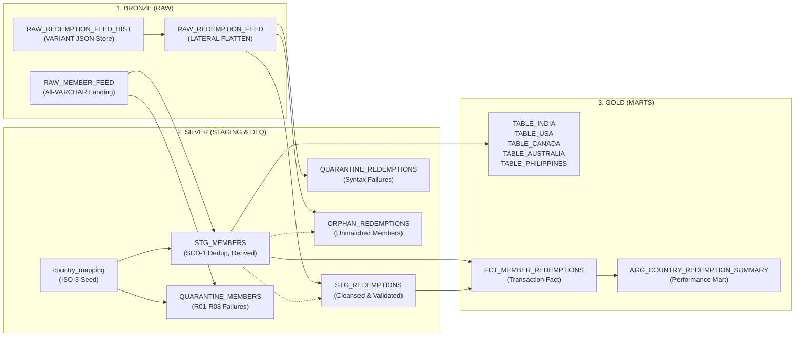

# 🏛️ SkyPoints Platform Architecture

> **Production-Grade ELT Architecture on Snowflake & dbt**  
> *Medallion Design, Dead Letter Queue Governance & Snowflake Native Integration*

---

## 1. Architectural Blueprint

The platform implements a **Medallion Architecture (Bronze → Silver → Gold)** with strict schema isolation, automated data quality gates, and zero-data-loss dead letter queueing.



---

## 2. Layer Specifications

### 2.1 Inbound Stages & Bronze Layer (`RAW` Schema)
- **Snowflake Internal Stages**:
  - `@RAW.STAGE_MEMBER_FEED`: Internal stage for daily pipe-delimited flat files (associated with file format `RAW.FF_PIPE_DELIMITED`).
  - `@RAW.STAGE_REDEMPTION_FEED`: Internal stage for daily partner airline JSON feeds (associated with file format `RAW.FF_JSON`).
- **Lenient Landing Pattern**: All flat file fields land as unconstrained `VARCHAR` to absorb upstream schema drift and oversized strings without aborting ingestion.
- **Semi-Structured Document Store**: JSON payloads are preserved immutably in a `VARIANT` column, with line items parsed via `LATERAL FLATTEN(input => parse_json(raw_payload):redemptions)`.
- **Traceability Metadata**: Lineage columns `INGESTION_TIMESTAMP`, `SOURCE_FILE_NAME`, and `SOURCE_FILE_ROW_NUMBER` are captured via Snowflake metadata.

### 2.2 Silver Layer (`STAGING` & `QUARANTINE` Schemas)
- **Deterministic Deduplication (SCD-1)**: Enforces "latest record wins" per member using `QUALIFY ROW_NUMBER() OVER (PARTITION BY MEMBER_ID ORDER BY LAST_FLIGHT_DATE DESC NULLS LAST, INGESTION_TIMESTAMP DESC) = 1`.
- **Derived Metrics**:
  - `AGE`: Exact years derived from `DOB` with `LPAD(..., 8, '0')` handling dropped leading zeroes.
  - `STALE_MEMBER`: Inactivity flag (`'Y'` if days since flight > 90, else `'N'`).
- **ISO-3 Country Standardization**: Decoupled from SQL via `seeds/country_mapping.csv` mapping variants (`AU`, `PHIL`, `US`, `IND`) to ISO 3166-1 Alpha-3 standards (`USA`, `IND`, `CAN`, `AUS`, `PHL`).
- **Isolated Dead Letter Queue (`QUARANTINE`)**:
  - `QUARANTINE_MEMBERS`: Captures failures across rules R01–R08 with pipe-separated error codes.
  - `ORPHAN_REDEMPTIONS`: Routes clean redemptions whose member is missing or quarantined.

### 2.3 Gold Layer (`MARTS` Schema)
- **Country Member Marts**: 5 dedicated target tables (`TABLE_INDIA`, `TABLE_USA`, `TABLE_CANADA`, `TABLE_AUSTRALIA`, `TABLE_PHILIPPINES`). Validated by a singular exclusivity test asserting each member appears in exactly one country mart.
- **Transaction Fact Mart (`FCT_MEMBER_REDEMPTIONS`)**:
  - Joins redemptions to member profiles on `MEMBER_ID`.
  - Enriched with `PARTNER_TYPE` (Internal vs. Alliance), `MEMBER_TENURE_DAYS_AT_TXN`, `DAYS_SINCE_LAST_FLIGHT_AT_TXN`, `WAS_STALE_AT_REDEMPTION`, and `MEMBER_AGE_GROUP`.
- **Aggregated Performance Mart (`AGG_COUNTRY_REDEMPTION_SUMMARY`)**:
  - Pre-aggregates metrics by country, partner, partner type, and status for sub-second executive reporting.

---

## 3. Snowflake Native Git & dbt Workspaces Integration

The project is natively integrated with Snowflake Workspaces, enabling zero-install execution directly inside the Snowflake UI:

```
GitHub Repository (Sumit-Thakkar/skypoints-loyalty-platform)
                          │
            [git_api_integration + HTTPS]
                          ▼
Snowflake Git Repository Stage (SKYPOINTS_DB.RAW.skypoints_repo)
                          │
                          ▼
Snowflake Native dbt Studio (Interactive DAG, Model Runner, Test Engine)
```

### Visual Operations in Snowflake UI:
1. **Select Operation**: Choose `Seed`, `Run`, or `Test` from the operation selector.
2. **Provide Flags**: Filter runs using standard dbt syntax (e.g. `--select marts` or `--select staging`).
3. **Execute**: Triggers compute on `SKYPOINTS_WH` without requiring local Python or dbt installations.
4. **Interactive Lineage (DAG)**: The **DAG** tab automatically visualizes the entire 16-node dependency graph from raw stages to gold marts.

---

## 4. Key Engineering Decisions

| Decision | Rationale | Production Trade-Off |
|---|---|---|
| **SCD Type 1 ("Latest Wins")** | Mandated by business requirements for current active country routing. | Historical residency audits can be added via `dbt snapshot` (SCD-2) if compliance requires. |
| **Reference Seed vs. CASE** | Decouples country mapping from transformation SQL into version-controlled CSV. | Adding new country aliases requires zero SQL edits—just `dbt seed`. |
| **Physical Schema DLQ** | Isolates bad data in `QUARANTINE` away from `STAGING` and `MARTS`. | Prevents accidental reporting queries on dirty data; enables separate RBAC policies. |
| **INNER JOIN on Fact** | Silver referential checks guarantee all redemptions match a clean member. | Guarantees zero `NULL` dimension fields in Gold; enables Snowflake inner partition pruning. |
| **Two-Tier Fact Design** | Atomic transaction fact (`FCT`) + Pre-aggregated summary mart (`AGG`). | Delivers row-level drill-down for audits and O(1) latency for executive dashboards. |

---

## 5. Scalability & Performance on Billions of Records

1. **Micro-Partition Pruning**: Clustering `FCT_MEMBER_REDEMPTIONS` on `(TXN_DATE, MEMBER_COUNTRY)` eliminates 95%+ of scanned data for date- and country-filtered queries.
2. **Incremental Processing**: Bronze JSON parsing and Silver transactions use Snowflake native `MERGE` to process only new batches (`INGESTION_TIMESTAMP > MAX(INGESTION_TIMESTAMP)`).
3. **Multi-Cluster Auto-Scaling**: `SKYPOINTS_WH` automatically spins up secondary clusters during heavy concurrent ingestion and scales down to zero when idle (`AUTO_SUSPEND = 60`).
